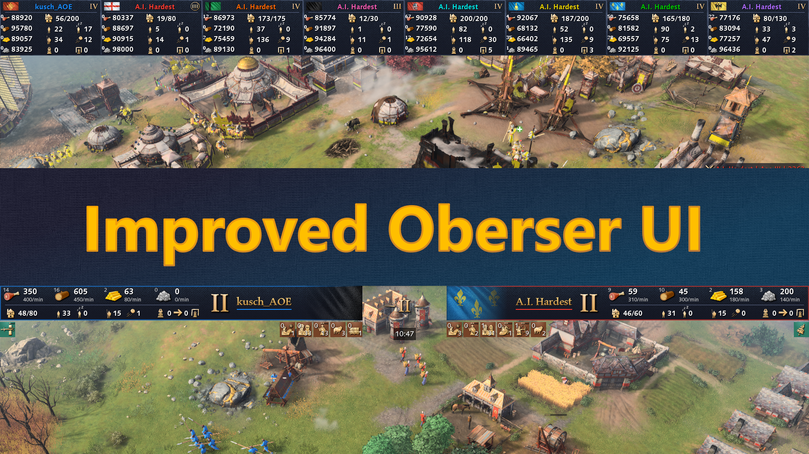

# AoE4_ObserverUI

A game mode for Age of Empires IV with the sole purpose of improving the observer and replay UI.

Due to the nature of the tool currently used by bigger tournaments and streamers it has to remain closed source and cannot be distributed widely. With the official Content Editor there are now other means to improve the UI that do not require secrecy but also suffer from their own limitations.

## Limitations
- Updating a mod breaks all replays of games played with that mod
- You cannot decide on using the improved UI after the game is played, the mod has to be included when the game is started
- Thus the improved UI cannot be used for ranked play or quick matches, only for custom games

## Fatal Scar Error
Right next to the minimap is a button to toggle between the improved and the classic UI. It also stopps all scripts of the new UI. If you run into a 'Fatal Scar Error', click the button to turn the new UI off, press 'Escape' to open the game menu and then resume the game or replay.

## Known Issues
Hiding the dynasty button doesn't work properly. As a workaround switch to the classic UI and back to the new UI using the 'UI' button next to the minimap.
